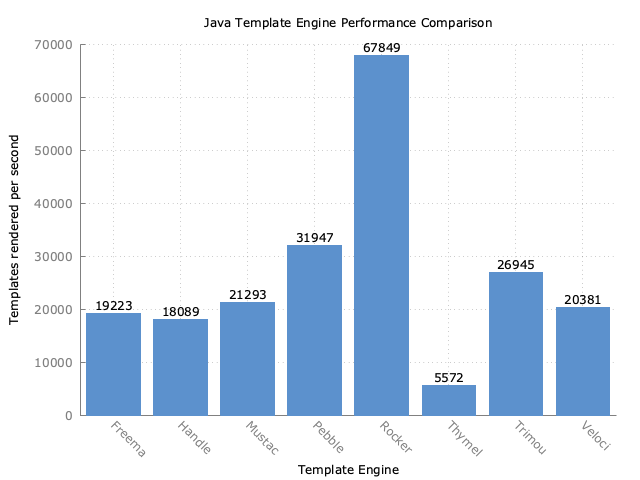

template-benchmark
================

JMH benchmark for popular Java template engines:

* [Beetl](http://ibeetl.com/guide/beetl.html)
* [Chunk Templates](http://www.x5software.com/chunk/examples/ChunkExample)
* [Freemarker](http://freemarker.org/)
* [Handlebars](https://github.com/jknack/handlebars.java)
* [HTTL](http://httl.github.io/en/)
* [Jetg](https://github.com/fbsgen/jetg/)
* [JinJava](https://github.com/HubSpot/jinjava)
* [Mustache](https://github.com/spullara/mustache.java)
* [Pebble](http://www.mitchellbosecke.com/pebble)
* [Rocker](https://github.com/fizzed/rocker)
* [Rythm](http://rythmengine.org/)
* [Thymeleaf](http://www.thymeleaf.org/)
* [Trimou](http://trimou.org/)
* [Velocity](http://velocity.apache.org/)

Running the benchmark
======================

1. Download the source code and build it (`mvn clean install`)
2. Run the entire benchmark suite with `java -jar target/benchmarks.jar`
3. (Optional) To run a single benchmark, such as Mustache, use `java -jar target/benchmarks.jar Mustache`

Generating plot
===============
1. Run benchmark while exporting results to csv with `java -jar target/benchmarks.jar -rff results.csv -rf csv`
2. Use gnuplot to generate plot with `gnuplot benchmark.plot`. This will output `results.png`.

Rules of Template Engine Configuration
======================================
It is imperative that each template engine is configured in way to reflect real-world usage as opposed to it's *optimal* configuration. Typically this means an out-of-the-box configuration.

To strive for a common set of features across template engines, the following configurations are expected:
* Disabling of HTML escaping
* Template loaded from classpath prior to actual benchmark

Interpreting the Results
========================
The benchmarks measure throughput, given in "ops/time". The time unit used is seconds.
Generally, the score represents the number of templates rendered per second; the higher the score, the better.

Example Results
===============

